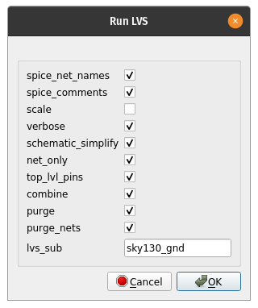

# Running LVS 

*WARNING*: Make sure you are using a DRC clean layout for this tutorial. While layouts with
DRC errors *might* work, they also might not. It depends on the DRC error.

LVS will compare a layout with a netlist in SPICE (or CDL) format. CDL is
"Cadence Description Language" and is essentially the same as SPICE. For more
understanding of SPICE syntax, take a look at the [SPICE](spice.md) tutorial.

After running LVS, you are presented with an option to import the SPICE netlist:

where you should select the SPICE netlist: ``sky130_fd_sc_hd__inv_1.spice``. 
After this, the LVS options menu will appear:

Make sure to uncheck the "scale" option in the LVS dialog box. Sky130 uses an
odd scale factor in the SPICE netlist of microns instead of meters. If you
don't uncheck this, the transistor sizes won't match and your LVS will fail.

After running LVS, you will get a window with the results like this:

The "objects" in the netlist are pins (inputs and outputs), nets (connections 
in the netlist), and devices (transistors, resistors, capacitors, etc.). In this
case, they are all green because they all match. The numbers by the nets and
the pins are the number of objects that things are connected to. For example, net
A is connected to the input pin A and the gate of both the PMOS and NMOS transistor.

If you select the "Netlist" tab in the browser, you can click on nets, pins, and
devices and they will highlight in the layout window. For example, if you click
on the "A" net, it will highlight the input pin A and the gate of the PMOS and NMOS.
This includes all of the polysilicon and the licon and li shapes for the A input.
Under "Configuration", you can also change the color and pattern of the highlighting
if it is difficult to see.

## Common LVS errors

### Parameter mismatch

### Substrate connection

### Missing devices

### Unconnected net

### Short-circuit connection

### Pin mismatch
