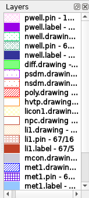

# Setting up KLayout and PDK for Sky130

## Installing KLayout

The KLayout that comes with OpenLane-2 Nix/Docker does not have Qt5 support,
which is required for the Sky130 technology files and the 2.5D viewing. You
will need to install KLayout from the [KLayout
website](https://www.klayout.de/build.html). It is pre-built for nearly all
platforms (Windows, MacOS, Linux) and is easy to install. 
- Windows 64-bit: [klayout-0.29.4-win64-install.exe](https://www.klayout.org/downloads/Windows/klayout-0.29.4-win64-install.exe)
- Ubuntu 20.04: [klayout-0.29.4-1_amd64.deb](https://www.klayout.org/downloads/Ubuntu/klayout-0.29.4-1_amd64.deb)
- MacOS: Depends on your OS Version. Check the [KLayout website](https://www.klayout.de/build.html) for the latest version.

*We have tested with version 0.29.4.* While this is not the newest, it is the same
as the version used in OpenLane-2, so it should be compatible.

*WARNING*: If you install another version, you must *UNINSTALL* KLayout before using
OpenLane-2 in subsequent parts of the class. Or, at least, removing it from
your PATH. The OL2 developers use locally installed executables instead of the
ones in the Docker container when they exist. You may run into problems during
KLayout steps in OL2 if you do not do this!

## Clone this repository

This repository contains the Sky130 technology files for KLayout. Clone this using:

```bash
git clone git@github.com:VLSIDA/cse122-222a-w25.git
cd cse122-222a-w25
```

## Starting KLayout with Sky130

The subdirectory `klayout/tech` contains the Sky130 technology files for
KLayout in one convenient place. You can start KLayout and have it use these by
running the following command:

```bash
KLAYOUT_PATH=klayout klayout -e
```
where klayout is the subdirectory with the tech subdirectory.
If you are in another directory, you can specify the absolute path instead:

```bash
KLAYOUT_PATH=/path/to/klayout_subdir klayout -e
```

You will be prompted with the following window each ti


You will then be greeted with the main KLayout window. 


# Loading a GDS file

You can open a GDS file by selecting `File` -> `Open` and selecting the GDS file you want to open. Select
the GDS file in the klayout subdirectory called 'sky130_fd_sc_hd__inv_1.gds' and you will see the following:


Select the drop down menu in the upper right with the "T" to select the Sky130 technology and
then click the sky130 button. You should see:


# Layer palette

On the right, you should see the "Layers" palette. However, this includes a lot of layers that
are not used and are grayed out. To only show the layers that are used in the cell click,
right click any layer and select "Hide Empty Layers". You should now see:



If you double click on any layer, it will make it invisible. If you double click again, it will
make it visible. You can also select multiple layers by holding down the shift key and selecting
a range, or holding down the control key and selecting individual layers.

# Sky130 Menu

If the Sky130 technology files are properly loaded, you should see a menu called "Efabless sky130" with
the following contents:

## Running DRC


There are a few options for running DRC: BEOL, FEOL, Full, Custom. BEOL means
"back-end of line" and is short for the device layers. FEOL means "front-end of
line" and is short for the metal layers. Full runs both BEOL and FEOL. Custom
can run a custom subset of DRC checks. Sometimes, you might want to run just
the FEOL checks to save run-time if, for example, you are just checking the
routing and you know your standard cells pass DRC.


## Running LVS

Make sure to uncheck the "scale" option in the LVS dialog box. Sky130 uses an odd scale factor in the spice
netlist of microns instead of meters. If you don't uncheck this, the transistor sizes won't match and your
LVS will fail.


# Closing crash

For some reason, on my Ubuntu machine, KLayout crashes when I close it. I get this window and must select "Cancel" to
fully exit out:


