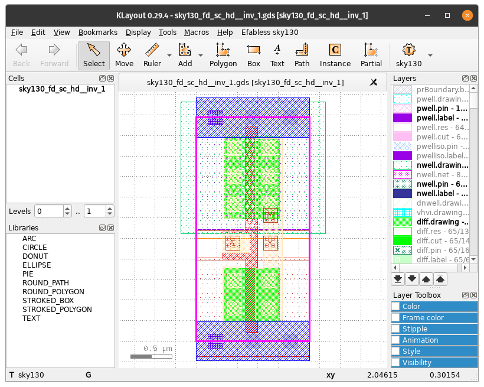
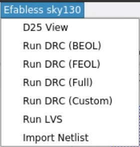

# Setting up KLayout and PDK for Sky130

## Installing KLayout

The KLayout that comes with OpenLane-2 Nix/Docker does not have Qt5 support,
which is required for the Sky130 technology files and the 2.5D viewing. You
will need to install KLayout from the [KLayout
website](https://www.klayout.de/build.html). It is pre-built for nearly all
platforms (Windows, MacOS, Linux) and is easy to install. 
- Windows 64-bit: [klayout-0.29.4-win64-install.exe](https://www.klayout.org/downloads/Windows/klayout-0.29.4-win64-install.exe)
- Ubuntu 20.04: [klayout-0.29.4-1_amd64.deb](https://www.klayout.org/downloads/Ubuntu/klayout-0.29.4-1_amd64.deb)
- MacOS: Depends on your OS Version. Check the [KLayout website](https://www.klayout.de/build.html) for the latest version.

*We have tested with version 0.29.4.* While this is not the newest, it is the same
as the version used in OpenLane-2, so it should be compatible.

*WARNING*: If you install another version, you must *UNINSTALL* KLayout before using
OpenLane-2 in subsequent parts of the class. Or, at least, remove it from
your PATH. The OL2 developers use locally installed executables instead of the
ones in the Docker container when they exist. You may run into problems during
KLayout steps in OL2 if you do not do this!

## Clone this repository

This repository contains the Sky130 technology files for KLayout. Clone this using:

```bash
git clone git@github.com:VLSIDA/cse122-222a-w25.git
cd cse122-222a-w25
```

## Starting KLayout with Sky130

The subdirectory `klayout/tech` contains the Sky130 technology files for
KLayout in one convenient place. You can start KLayout and have it use these by
running the following command:

```bash
KLAYOUT_PATH=klayout klayout -e
```
where klayout is the subdirectory with the tech subdirectory.
If you are in another directory, you can specify the absolute path to the klayout subdirectory instead.

You must specify the "-e" argument to enable edit mode. Otherwise, KLayout is
just started in read-only (viewer) mode.

You will then be greeted with the main KLayout window:


# Using KLayout

## Loading a GDS file

You can open a GDS file by selecting `File` -> `Open` and selecting the GDS file you want to open. Select
the GDS file in the klayout subdirectory called 'sky130_fd_sc_hd__inv_1.gds' and you will see the following:



## Layer palette

On the right, you should see the "Layers" palette. However, this includes a lot of layers that
are not used and are grayed out. To only show the layers that are used in the cell click,
right click any layer and select "Hide Empty Layers". You should now see:


If you double click on any layer, it will make it invisible. If you double click again, it will
make it visible. You can also select multiple layers by holding down the shift key and selecting
a range, or holding down the control key and selecting individual layers.

## Sky130 Menu

If the Sky130 technology files are properly loaded, you should see a menu called "Efabless sky130" with
the following contents:



The 2.5D viewer lets you look at and interact with a "3D" view of the layout:


This is useful for seeing how the the cell will look with the z-dimension
information. Note that commercial tools do not have this feature and it is only
really used for educational purposes.

The [Running DRC](klayout-drc.md) and [Running LVS](klayout-lvs.md) tutorials discuss how to run DRC and LVS, respectively.

The [Edit](klayout-edit.md) tutorial has some useful instructions for editing shapes in the layout.

## Closing crash

For some reason, on my Ubuntu machine, KLayout crashes when I close it. I get this window and must select "Cancel" to
fully exit out:


