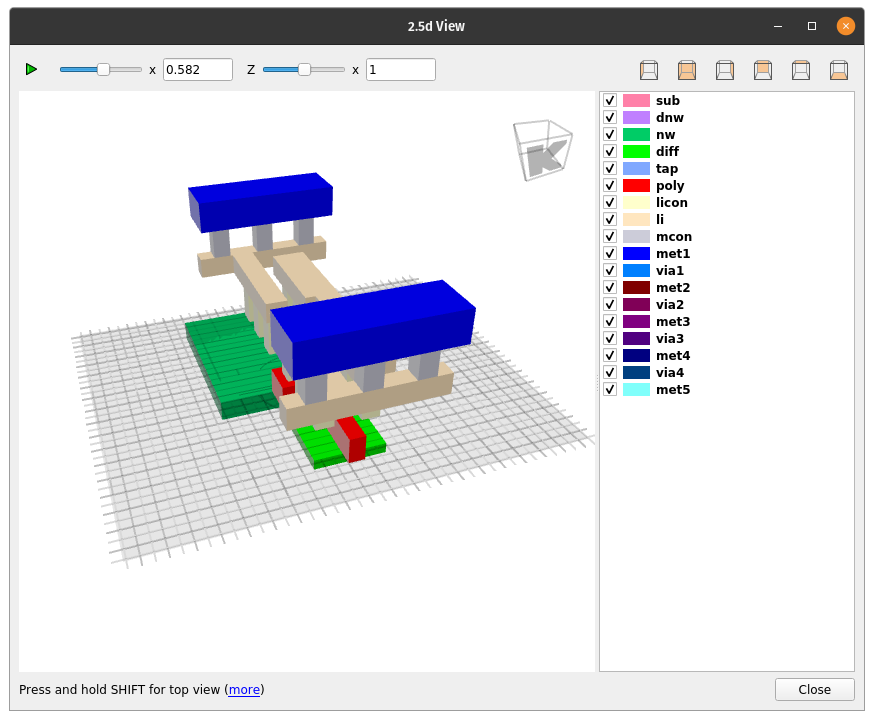
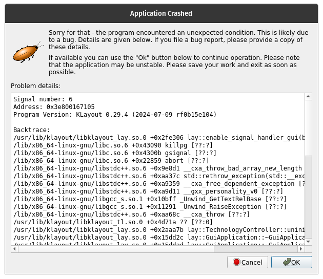

# Setting up KLayout and PDK for Sky130

## Installing KLayout

The KLayout that comes with OpenLane-2 Nix/Docker does not have Qt5 support,
which is required for the Sky130 technology files and the 2.5D viewing. You
will need to install KLayout from the [KLayout
website](https://www.klayout.de/build.html). It is pre-built for nearly all
platforms (Windows, MacOS, Linux) and is easy to install. 
- Windows 64-bit: [klayout-0.29.4-win64-install.exe](https://www.klayout.org/downloads/Windows/klayout-0.29.4-win64-install.exe)
- Ubuntu 20.04: [klayout-0.29.4-1_amd64.deb](https://www.klayout.org/downloads/Ubuntu/klayout-0.29.4-1_amd64.deb)
- MacOS: Depends on your OS Version. Check the [KLayout website](https://www.klayout.de/build.html) for the latest version.

*We have tested with version 0.29.4.* While this is not the newest, it is the same
as the version used in OpenLane-2, so it should be compatible.

*WARNING*: If you install another version, you must *UNINSTALL* KLayout before using
OpenLane-2 in subsequent parts of the class. Or, at least, remove it from
your PATH. The OL2 developers use locally installed executables instead of the
ones in the Docker container when they exist. You may run into problems during
KLayout steps in OL2 if you do not do this!

## Starting KLayout with Sky130

Clone this repository to your local machine:
```bash
git clone git@github.com:VLSIDA/chip-tutorials.git
cd chip-tutorials/klayout
```
The subdirectory `tech` contains the Sky130 technology files for
KLayout in one convenient place. You can start KLayout and have it use these by
running the following command:

```bash
KLAYOUT_PATH=. klayout -e
```
where "." refers to the current directory (chip-tutorials/klayout).
If you don't specify the *KLAYOUT_PATH* variable,
it will use the tech directory in your home directory which likely does not
exist.

You must specify the "-e" argument to enable edit mode. Otherwise, KLayout is
just started in read-only (viewer) mode.

You will then be greeted with the main KLayout window:


# Using KLayout

## Loading a GDS file

You can open a GDS file by selecting `File` -> `Open` and selecting the GDS file you want to open. Select
the GDS file in the klayout subdirectory called 'sky130_fd_sc_hd__inv_1.gds' and you will see the following:


## Layer palette

On the right, you should see the "Layers" palette. However, this includes a lot of layers that
are not used and are grayed out. To only show the layers that are used in the cell click,
right click any layer and select "Hide Empty Layers". You should now see:


If you double click on any layer, it will make it invisible. If you double click again, it will
make it visible. You can also select multiple layers by holding down the shift key and selecting
a range, or holding down the control key and selecting individual layers.

## Sky130 Menu

If the Sky130 technology files are properly loaded, you should see a menu called "Efabless sky130" with
the following contents:


### 2.5D Viewer

The 2.5D viewer lets you look at and interact with a "3D" view of the layout:



This is useful for seeing how the the cell will look with the z-dimension
information. Note that commercial tools do not have this feature and it is only
really used for educational purposes.

### Running DRC and LVS

The [Running DRC](klayout-drc.md) tutorial discusses how to run Design Rule Checks (DRC) in KLayout with Sky130.
The [Edit](klayout-edit.md) tutorial has some useful instructions for editing shapes in the layout which
can be used to fix DRC errors.

The [Running LVS](klayout-lvs.md) tutorial discusses how to run LVS as well as some common errors and how to fix them.


## Closing crash

For some reason, on my Ubuntu machine, KLayout crashes when I close it. I get this window and must select "Cancel" to
fully exit out:



# Reading Materials

- Digital Integrated Circuits (2nd Edition) - A Design Perspective by Rabaey, Chandrakasan, & Nikolic (ISBN-10: 0130909963) 
- Electronic Design Automation for IC Implementation, Circuit Design, and Process Technology Edited by Luciano Lavagno, Igor L. Markov, Grant Martin, and Louis K. Scheffer, CRC Press 2016. (ISBN-10: 0849379245) It is [available through the campus library](https://ucsc.primo.exlibrisgroup.com/permalink/01CDL_SCR_INST/gfkjds/informaworld_s10_1201_9781315215112_version2) 
  
# License

Copyright 2024 VLSI-DA (see [LICENSE](LICENSE) for use)
